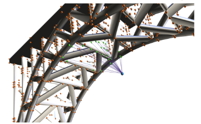
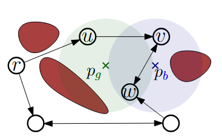

# Scalable Inspection Planning via Flow-based MILP

Official implementation of the paper:

**Scalable Inspection Planning via Flow-based Mixed Integer Linear Programming**

Adir Morgan, Kiril Solovey, Oren Salzman

Technion – Israel Institute of Technology
<!-- (WAFR 2026) -->

---
<p align="center">
    
    
</p>


## Overview

This repository implements scalable Mixed Integer Linear Programming (MILP) solvers for the **Graph Inspection Planning (GIP)** problem.

Inspection Planning (IP) asks:

> What is the minimum-cost robot tour that inspects all required Points of Interest (POIs)?

After discretization via roadmap-based motion planning, the problem becomes **Graph Inspection Planning (GIP)** — a combinatorial optimization problem that jointly enforces:

* ✅ Global path connectivity
* ✅ POI coverage
* ✅ Minimum traversal cost

GIP generalizes both **Set Cover** and **TSP**, making it NP-hard and challenging at real-world scales.

___
## :open_file_folder: Installation 

### Requirements

* Python 3.12+
* Gurobi Optimizer (tested with v12+)
* NumPy
* NetworkX
* Matplotlib

Install dependencies:

```bash
pip install -r requirements.txt
```

Make sure Gurobi is properly licensed and accessible from Python (`gurobipy`).

---

## :computer: Running the Solver

### Example: Group-Cutset (recommended)

```bash
 python RunSolver.py 
 --solver GroupCutset 
 --experiment Crisp1000 
 --TimeOut 300
```

___

---

## Key Contributions Implemented Here

This repository includes:

### 1️⃣ Multiple MILP Formulations

* **Baseline MILP** - Based on charge variables formulation by Mizutani et. al. (WAFR'24).
* **Single-Commodity Flow (SCF) formulation**
* **Multi-Commodity Flow (MCF) formulation**
* **Group-Cutset (Branch-and-Cut) formulation** ← most scalable

### 2️⃣ Branch-and-Cut Solver

* Lazy constraint generation
* Connectivity-based separation oracle
* Flow-based separation oracle
* Combined oracle (recommended)

### 3️⃣ Problem-Specific Primal Heuristic

* LP-guided cost discounting
* Group-covering tree construction
* Eulerian augmentation via:

  * Greedy matching (default)
  * Minimum-weight perfect matching

### 4️⃣ Experimental Benchmarks

* CRISP medical inspection scenario
* Bridge inspection scenario
* Large and Small-scale simulated planar environments

---

## Repository Structure

```text
.
├── GIP/
│   ├── separation/            
│   ├── heuristics/            
│   ├── solvers/               
│   └── solver_utils/          
│
├── benchmarks/
│   ├── crisp/
│   └── bridge/
│
├── Utils/
│   ├── Readers/
│   ├── ResultsAnalysis/
│   └── GurobiUtils.py
│
├── Simulator/                 
├── requirements.txt
└── README.md
```

---
<!--
### Example: Compare formulations

```bash
python experiments/large_scale.py \
    --n 10000 \
    --k 5000 \
    --formulations scf charge group_cutset
```

---
-->

## Formulation Summary

| Formulation  | Strength of LP | Memory Usage | Scalability   |
| ------------ | -------------- | ------------ | ------------- |
| SCF          | Weak           | Low          | Medium        |
| Charge       | Medium         | Low          | Medium        |
| MCF          | Very Strong    | Very High    | Small only    |
| Group-Cutset | Strong         | Low          | ⭐ Large-scale |

The **Group-Cutset Branch-and-Cut** formulation:

* Avoids Big-M constants
* Avoids explicit multi-commodity variables
* Adds violated connectivity constraints lazily
* Scales to graphs with **15,000+ vertices and thousands of POIs**

---
<!--
## Simulator

The `Simulator/` module generates configurable GIP instances:

* 2D maze environments
* RRG roadmap construction
* Configurable:

  * Number of vertices `n`
  * Number of POIs `k`
  * Sensor FOV angle
  * Inspection range
-->

<!-- 
Example:

```bash
python simulator/generate_instance.py \
    --n 5000 \
    --k 2000 \
    --maze_size 20
```

---


## Reproducing Paper Results
-->

---
<!-- 
## Citation

If you use this code, please cite:

```bibtex
@inproceedings{morgan2026gip,
  title     = {Scalable Inspection Planning via Flow-based Mixed Integer Linear Programming},
  author    = {Morgan, Adir and Solovey, Kiril and Salzman, Oren},
  booktitle = {Workshop on the Algorithmic Foundations of Robotics (WAFR)},
  year      = {2026}\
}
```
-->
